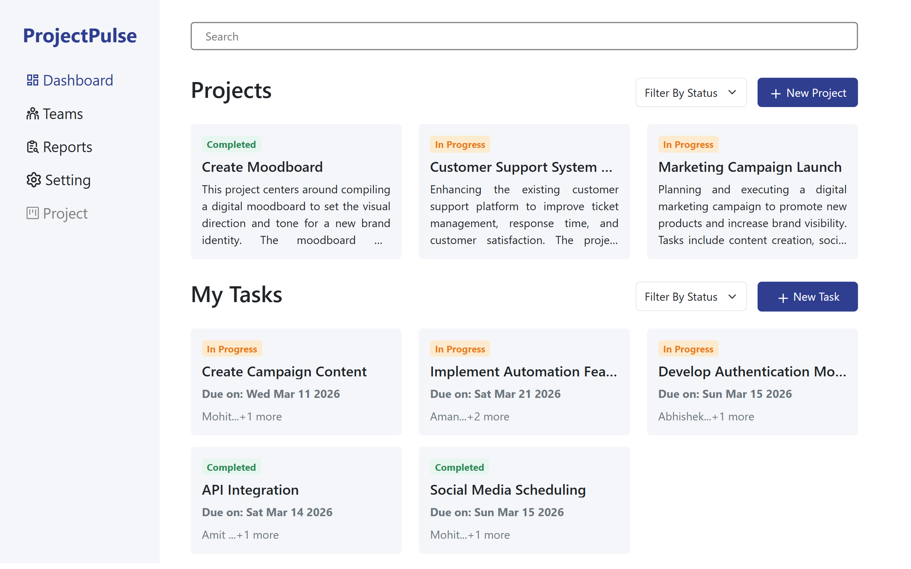
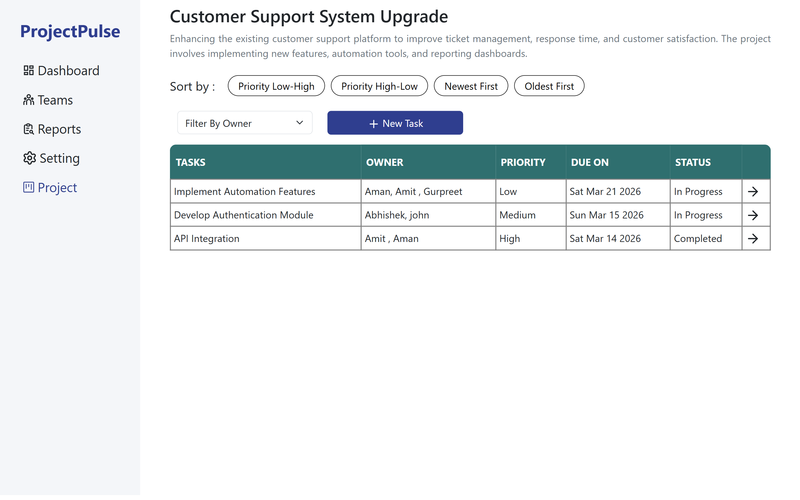
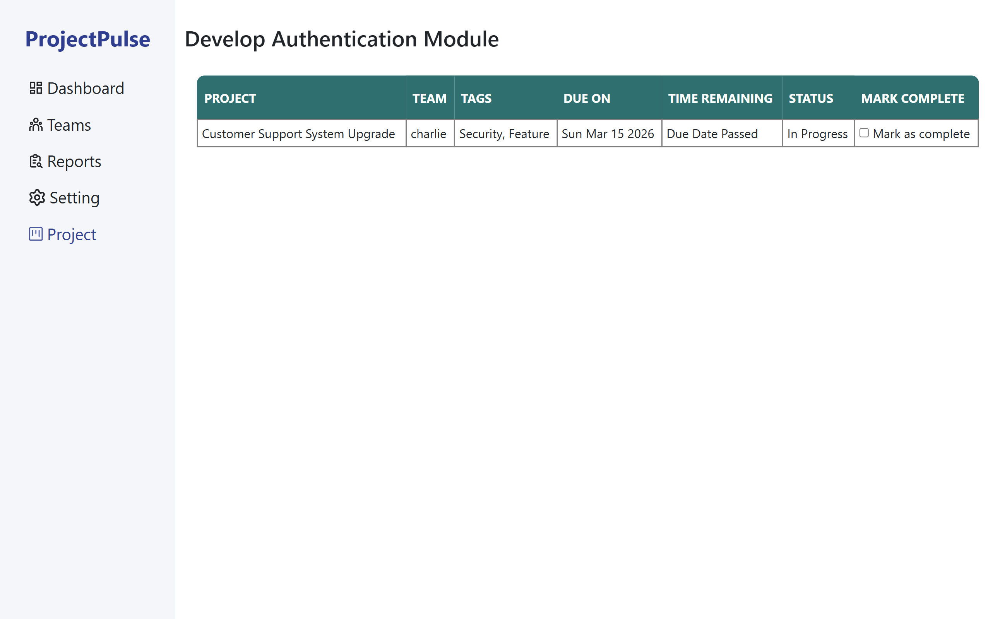
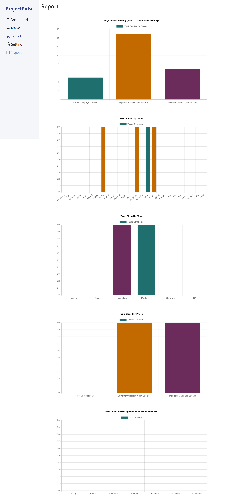
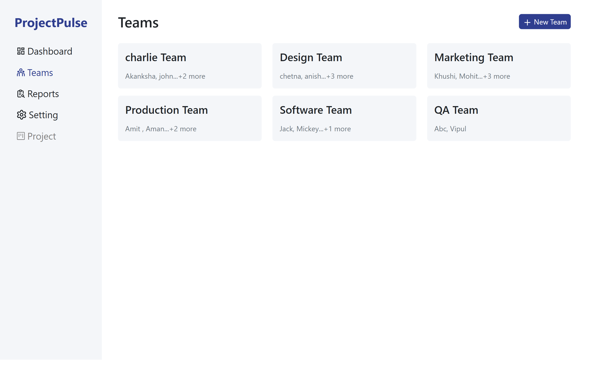
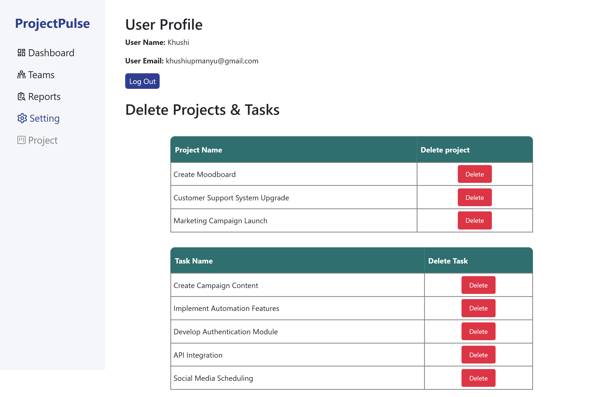

# ProjectPulse

A full-stack task management application featuring secure authentication, task organization, search, filtering, interactive dashboards, and backend data persistence.<br>
Built with a React frontend, Express/Node backend, and MongoDB database.

---

## Tech Stack

**Frontend**
- React.js
- React Router DOM
- JavaScript (ES6+)
- Bootstrap 5
- React Icons
- Lucide React
- React Toastify
- HTML5 & CSS3

**Backend**
- Node.js
- Express.js
- RESTful APIs

**Database**
- MongoDB

---

## Live Demo

[Live Application](https://project-pulse-frontend-five.vercel.app)<br><br>
[Project Walkthrough](YOUR_VIDEO_LINK)<br><br>
[Backend Repository](https://github.com/Abhishek-Das251002/ProjectPulse-Backend)

---

## Screenshots

### Dashboard



### Project Details



### Task Details



### Reports



### Teams



### User Profile



---

## Features

**Authentication**

- Secure user authentication
- Protected application routes

**Dashboard**

- View task statistics and project overview
- Monitor task progress through interactive dashboards

**Task Management**

- Create, edit, and delete tasks
- Organize tasks efficiently

**Search & Filtering**

- Search tasks instantly
- Filter and sort tasks based on different criteria

**Reports**

- View project insights through interactive reports
- Track task completion and productivity

**User Experience**

- Responsive interface across devices
- Loading indicators during API requests
- Toast notifications for user actions

---

## Quick Start

```bash
git clone https://github.com/Abhishek-Das251002/Pet-Store-Frontend.git

cd ProjectPulse-Frontend

npm install

npm run dev
```

---

## Environment Setup

Create a `.env` file in the backend root directory and add the following environment variables:

```env
PORT=3000
MONGODB_URI=your_mongodb_atlas_connection_string
```
---

## Deployment

| Service | Platform |
|---------|----------|
| Frontend | Vercel |
| Backend | Vercel |
| Database | MongoDB Atlas |

---

## API References

### POST /admin/login

Authenticate users.

### POST /projects

Create a new project

### GET /projects

Retrieve all projects

### POST /tasks

Create a new task.

### GET /tasks

Retrieve all tasks.

### POST /tasks/:taskId

Update an existing task.

### DELETE /tasks/:taskId

Delete a task.

---

> **Note:** Detailed API request and response payloads are available in the [backend repository](https://github.com/Abhishek-Das251002/ProjectPulse-Backend).

---

## Future Improvements

- Implement email notifications for upcoming deadlines.
- Enable file attachments for tasks.

---

## Contact

If you have any questions or would like to discuss this project, feel free to connect with me.

**Email:** [abhishekgautam1966@gmail.com](mailto:abhishekgautam1966@gmail.com)<br><br>

**LinkedIn:** [Abhishek Gautam](https://www.linkedin.com/in/abhishek-gautam-dev)
